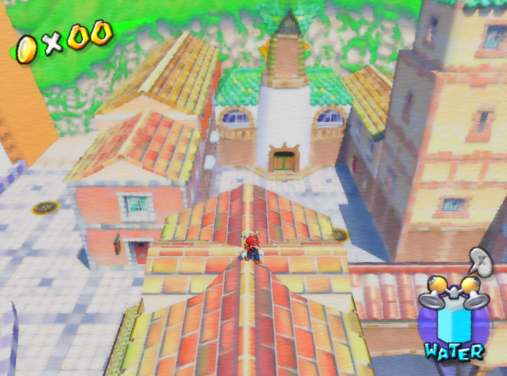

# ReShade Watercolor style shader implementation
A watercolor effect created in ReShade with an implementation of the guided filter for image abstraction.

This took a ton of work! If you would like to support me, please [donate](https://ko-fi.com/pangaea__), it would mean a lot. I spent months learning how to create shaders while writing a bespoke implementation of the guided filter alongside the implementation of the watercolor effect.

# Examples:

